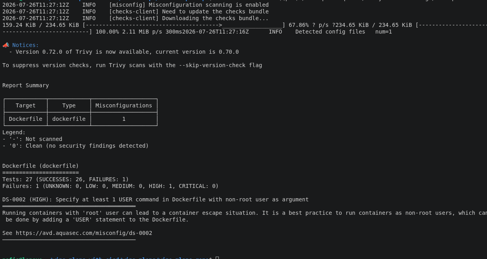
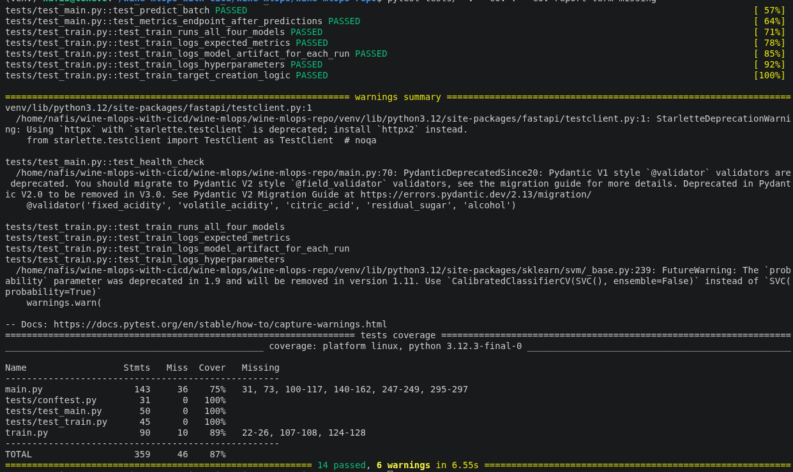

# Security Notes

## Dockerfile misconfiguration: container running as root (DS-0002)

### How it was found

Ran Trivy's config scanner against the Dockerfile to check for security
misconfigurations (separate from the image vulnerability/CVE scan):

```bash
docker run --rm -v $(pwd):/workspace aquasec/trivy:0.70.0 config /workspace
```

### Result




### The fix

Added a dedicated non-root system user in the Dockerfile, granted it
ownership of `/app` (since the app needs to read/write `data/` and
`models/`), and switched to it before the container's runtime process
starts:

```dockerfile
FROM python:3.11-slim

WORKDIR /app

RUN apt-get update && apt-get install -y --no-install-recommends gcc curl libpq-dev \
    && rm -rf /var/lib/apt/lists/*

COPY requirements.txt .
RUN pip install --no-cache-dir -r requirements.txt

COPY . .

RUN mkdir -p /app/data /app/models

# Create a non-root user and switch to it
RUN groupadd -r appuser && useradd -r -g appuser appuser \
    && chown -R appuser:appuser /app

USER appuser

HEALTHCHECK --interval=30s --timeout=5s --start-period=5s --retries=3 \
    CMD curl -f http://localhost:8000/ || exit 1

EXPOSE 8000

CMD ["uvicorn", "main:app", "--host", "0.0.0.0", "--port", "8000"]
```

Key points:
- `groupadd -r` / `useradd -r` create a system account with no home
  directory or login shell — minimal footprint, purpose-built for running
  the app
- `chown -R appuser:appuser /app` runs *before* `USER appuser` (needs root
  to change ownership) — without this, the app would lose permission to
  write to `data/`/`models/` at runtime
- `USER appuser` must come after every `RUN`/`COPY` step that needs root
  privileges (installing packages, etc.) — everything after this line,
  including the container's actual process, runs unprivileged

### Verification

Rebuilt the image and re-ran the same scan:

```bash
docker build -t wine-mlops-test .
docker run --rm -v $(pwd):/workspace aquasec/trivy:0.70.0 config /workspace
```

Expected result: `Tests: 27 (SUCCESSES: 27, FAILURES: 0)`.

Also confirmed the app still starts and runs correctly as the non-root user:

```bash
docker run --rm -p 8000:8000 wine-mlops-test
```

---

## Image vulnerability scan: stale pip/setuptools/wheel (CVE-2026-23949, CVE-2026-24049, and others)

### How it was found

Ran Trivy's image scanner (CVE scan, not config scan) against the built
image, generated as an artifact by the CI pipeline:

```bash
docker run --rm -v /var/run/docker.sock:/var/run/docker.sock \
  aquasec/trivy:0.70.0 image --severity CRITICAL,HIGH --ignore-unfixed \
  nfsr/wine-mlops:<image-tag>
```

### Result

8 vulnerabilities total (1 LOW, 5 MEDIUM, 2 HIGH, 0 CRITICAL). The Debian
OS layer itself was clean (0 findings) — every finding was in Python
packaging tools bundled inside the base image:

| Package | CVE | Severity | Installed | Fixed in |
|---|---|---|---|---|
| `jaraco.context` (setuptools dep) | CVE-2026-23949 | HIGH | 5.3.0 | 6.1.0 |
| `wheel` | CVE-2026-24049 | HIGH | 0.45.1 | 0.46.2 |
| `pip` | CVE-2025-8869, CVE-2026-3219, CVE-2026-6357, CVE-2026-8643 | MEDIUM | 24.0 | 26.1.2 |
| `setuptools` | CVE-2026-59890 | MEDIUM | 79.0.1 | 83.0.0 |
| `pip` | CVE-2026-1703 | LOW | 24.0 | 26.0 |

The two HIGH findings were what tripped the CI pipeline's
`exit-code: "1"` gate on CRITICAL/HIGH severity.

**Why it happened:** `pip`, `setuptools`, and `wheel` ship bundled with
the `python:3.11-slim` base image at whatever version it was built
with — they aren't something pulled from `requirements.txt`, so they
silently go stale unless explicitly upgraded.

### The fix

Added an explicit upgrade step right after `WORKDIR`, before anything
else installs:

```dockerfile
RUN pip install --no-cache-dir --upgrade pip setuptools wheel
```

Also folded `apt-get upgrade -y` into the existing apt layer to pick up
any Debian OS security patches at build time:

```dockerfile
RUN apt-get update && apt-get upgrade -y \
    && apt-get install -y --no-install-recommends gcc curl libpq-dev \
    && rm -rf /var/lib/apt/lists/*
```

### Verification

```bash
docker build -t wine-mlops-test .
docker run --rm -v /var/run/docker.sock:/var/run/docker.sock \
  aquasec/trivy:0.70.0 image --severity CRITICAL,HIGH --ignore-unfixed wine-mlops-test
```

Clean result — no CRITICAL/HIGH findings, CI's Trivy gate passes with
`exit-code: "1"` still fully enforcing the check (never relaxed).

---

## Test coverage: train.py went from 0% to 89%

### The gap

`train.py` (90 statements — model training, MLflow logging) had zero
test coverage. It talks to a live MLflow server for tracking, which
made it awkward to test directly, so it had been skipped when the
initial test suite (`tests/test_main.py`) was written.

Codecov dashboard before the fix:

| File | Coverage |
|---|---|
| `tests/` | 100.00% |
| `main.py` | 74.83% |
| `train.py` | **0.00%** |
| **Overall** | **~60%** |

### The fix

Added `tests/test_train.py`:
- Mocked every `mlflow.*` call (`set_tracking_uri`, `set_experiment`,
  `start_run`, `log_param`, `log_metric`, `mlflow.sklearn.log_model`)
  so no live MLflow server is needed
- Generated a small synthetic 30-row wine-quality CSV in a pytest
  fixture (`tmp_path`), roughly balanced between the two quality
  classes so stratified `train_test_split` has both classes to work
  with
- Let the *real* scikit-learn training run against that tiny dataset —
  all 4 models (RandomForest, LogisticRegression, GradientBoosting,
  SVM) actually train in a few seconds, exercising the real feature
  engineering, train/test split, and metric-calculation logic instead
  of mocking those too
- 5 tests total: all 4 models run, expected metrics get logged
  (accuracy/precision/recall/f1/train_time), model artifacts get
  logged once per model, hyperparameters get logged, and the
  `quality >= 7 -> target` label logic is correct

### Verification

```bash
pytest tests/ -v --cov=. --cov-report=term-missing
```


Result: 14 tests passed (9 existing + 5 new), `train.py` coverage
0% -> 89%, overall project coverage 60% -> 87%.

Confirmed on the Codecov dashboard after pushing:

| File | Coverage |
|---|---|
| `tests/` | 100.00% |
| `main.py` | 74.83% |
| `train.py` | **89%** (up from 0%) |
| **Overall** | **~87%** |

Remaining uncovered lines in `train.py` are the MLflow-connection
retry loop and the exception-handling branch for a failed
model-artifact log — deliberately left untested as low-value edge
cases relative to the effort to simulate them.