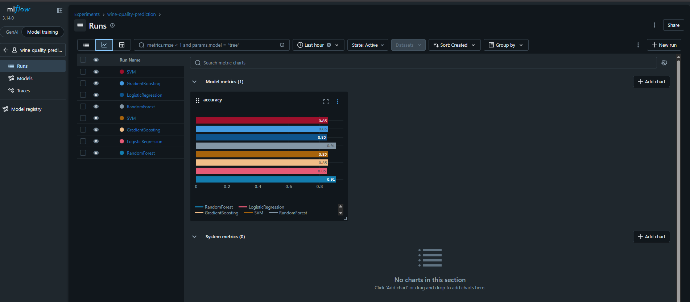
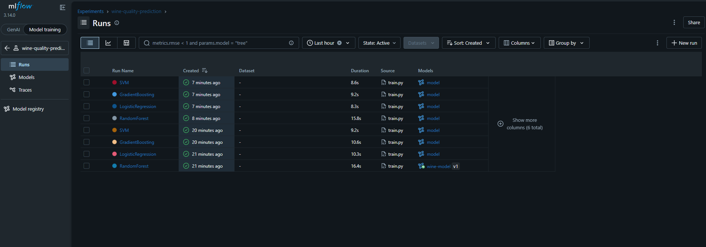
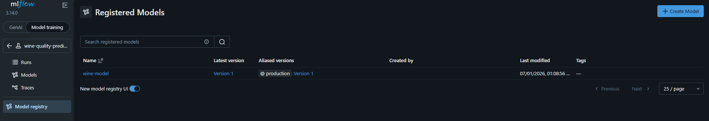
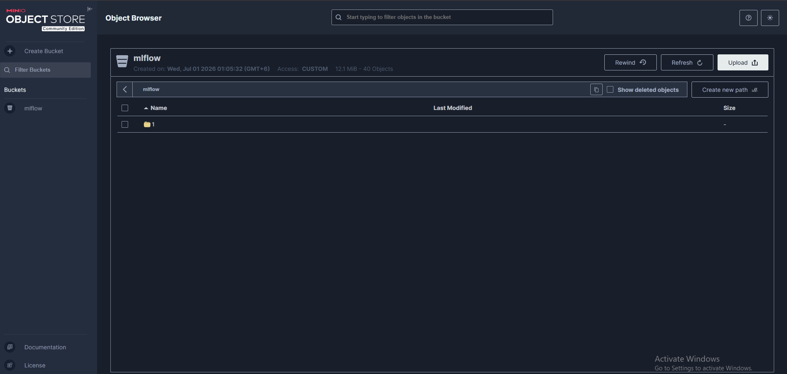
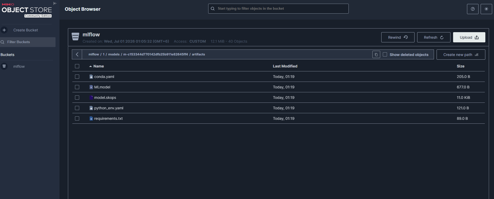
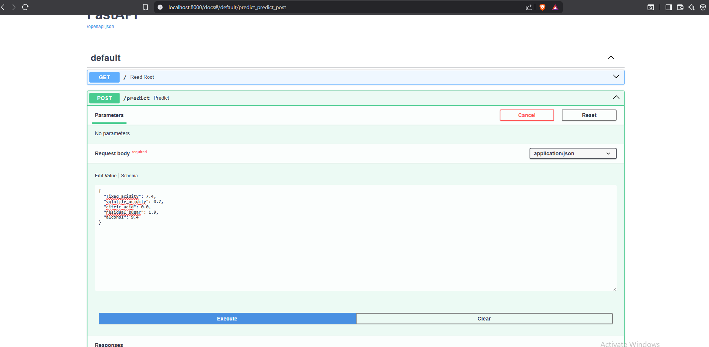

# 🍷 Wine Quality MLOps Pipeline

An end-to-end MLOps project for wine quality prediction using **MLflow**, **MinIO**, **PostgreSQL**, **FastAPI**, and **Docker**.


---

## 📋 Table of Contents

- [Architecture](#-architecture)
- [Features](#-features)
- [Quick Start](#-quick-start)
- [Project Structure](#-project-structure)
- [Services](#-services)
- [MLflow Tracking](#-mlflow-tracking)
- [MinIO Object Storage](#-minio-object-storage)
- [Model Registry](#-model-registry)
- [API Usage](#-api-usage)
- [Screenshots](#-screenshots)
- [Future Improvements](#-future-improvements)

---

## 🏗️ Architecture

```
┌─────────────┐     ┌──────────────┐     ┌─────────────────┐
│   Client    │────▶│  FastAPI     │────▶│  MLflow Registry │
│  (curl/web) │     │   (Port 8000)│     │  (Port 5001)    │
└─────────────┘     └──────────────┘     └─────────────────┘
                                                  │
                       ┌──────────────┐          │
                       │   PostgreSQL │◀─────────┘
                       │  (Metadata)  │
                       └──────────────┘
                              │
                       ┌──────────────┐
                       │    MinIO     │
                       │  (Artifacts) │
                       └──────────────┘
```

**Data Flow:**
```
winequality-red.csv
        │
        ▼
   train.py (4 Models)
        │
   ├────┴────┬────────┬──────────┐
   │         │        │          │
   ▼         ▼        ▼          ▼
PostgreSQL  MinIO   MLflow     Model
(Params)   (Files)  (Metrics)  Registry
   │         │        │          │
   └─────────┴────────┴──────────┘
              │
              ▼
        main.py (API)
              │
              ▼
      /predict endpoint
```

---

## ✨ Features

| Feature | Description |
|---------|-------------|
| 🔬 **Multi-Model Training** | RandomForest, GradientBoosting, LogisticRegression, SVM |
| 📊 **MLflow Tracking** | Parameters, metrics, artifacts logging |
| 🗂️ **Model Registry** | Version control with aliases (production, staging) |
| 🪣 **MinIO Storage** | S3-compatible artifact storage |
| 🐘 **PostgreSQL** | Production-grade MLflow backend |
| 🚀 **FastAPI** | High-performance prediction API |
| 🔒 **Secret Management** | Environment variables via `.env` |
| 🐳 **Docker Compose** | One-command full stack deployment |

---

## 🚀 Quick Start

### Prerequisites

- Docker & Docker Compose
- Git

### 1. Clone Repository

```bash
git clone https://github.com/nafisrahman006/wine-mlops.git
cd wine-quality-mlops
```

### 2. Configure Environment

```bash
# Copy example env file
cp .env.example .env

# Edit with your secrets (optional for local dev)
nano .env
```

### 3. Start All Services

```bash
docker-compose up --build
```

This will:
1. Start PostgreSQL database
2. Start MinIO object storage
3. Create MLflow bucket in MinIO
4. Start MLflow tracking server
5. Train 4 models (RandomForest, GradientBoosting, LogisticRegression, SVM)
6. Start FastAPI prediction service

### 4. Access Services

| Service | URL | Credentials |
|---------|-----|-------------|
| **FastAPI Docs** | http://localhost:8000/docs | - |
| **MLflow UI** | http://localhost:5001 | - |
| **MinIO Console** | http://localhost:9001 

---

## 📁 Project Structure

```
wine-quality-mlops/
│
├── 📂 data/
│   └── winequality-red.csv          # Dataset (Git-tracked)
│
├── 📄 main.py                        # FastAPI application
├── 📄 train.py                       # Multi-model training script
├── 📄 requirements.txt               # Python dependencies
├── 📄 Dockerfile                     # Container image
│
├── 📄 docker-compose.yml             # Full stack orchestration
├── 📄 .env.example                   # Environment template
├── 📄 .env                           # Secrets (Git-ignored)
│
├── 📄 .gitignore                     # Git ignore rules
├── 📄 .dockerignore                  # Docker ignore rules
│
└── 📄 README.md                      # This file
```

---

## 🔧 Services

### PostgreSQL (Database)

- **Image:** `postgres:15`
- **Port:** `5432` (internal)
- **Purpose:** MLflow metadata storage (runs, params, metrics)
- **Volume:** `pgdata` (persistent)

### MinIO (Object Storage)

- **Image:** `minio/minio:latest`
- **Ports:** `9000` (API), `9001` (Console)
- **Purpose:** Model artifacts, dataset backups
- **Volume:** `minio_data` (persistent)
- **Buckets:** `mlflow` (artifacts)

### MLflow (Tracking Server)

- **Port:** `5001`
- **Backend:** PostgreSQL
- **Artifacts:** MinIO S3
- **Features:** Experiment tracking, Model Registry

### Train (Model Training)

- **Trains 4 models:** RandomForest, GradientBoosting, LogisticRegression, SVM
- **Logs to:** MLflow + MinIO
- **Outputs:** `wine_model.pkl` (best model)

### API (FastAPI)

- **Port:** `8000`
- **Loads model from:** MLflow Model Registry (`wine-model@production`)
- **Endpoint:** `POST /predict`

---

## 📊 MLflow Tracking

### View Experiments

1. Open http://localhost:5001
2. Click **"wine-quality-prediction"** experiment
3. See all 4 model runs with metrics

### Compare Models

| Run Name | Accuracy | Duration |
|----------|----------|----------|
| RandomForest | ~0.906 | ~13s |
| GradientBoosting | ~0.903 | ~9s |
| SVM | ~0.872 | ~8s |
| LogisticRegression | ~0.866 | ~12s |

### Register Model

1. Click best run (e.g., RandomForest)
2. Go to **Artifacts** tab
3. Click **"Register Model"**
4. Name: `wine-model`
5. Go to **Model Registry** → `wine-model`
6. Click **"Add alias"** → `production`

---

## 🪣 MinIO Object Storage

### Console Access

- **URL:** http://localhost:9001
- **Login:** userid & Password

### Bucket Structure

```
mlflow/
└── 1/                                    # Experiment ID
    └── models/
        └── m-xxxxxxxxxxxxxxxx/          # Model ID
            └── artifacts/
                ├── MLmodel               # Metadata
                ├── model.skops           # Model file
                ├── conda.yaml            # Environment
                └── requirements.txt      # Dependencies
```

---

## 🎯 Model Registry

### How It Works

```
Training
    │
    ▼
MLflow Log Model ──▶ Registry ──▶ Alias: "production"
    │                              │
    ▼                              ▼
MinIO Storage              API Loads from Alias
```

### API Loading

```python
# main.py
model = mlflow.sklearn.load_model("models:/wine-model@production")
```

**Benefits:**
- No hardcoded Run IDs
- Easy model promotion
- Rollback support

---

## 🌐 API Usage

### Health Check

```bash
curl http://localhost:8000/
```

**Response:**
```json
{"message": "Wine Quality Prediction API is live"}
```

### Predict Single Wine

```bash
curl -X POST http://localhost:8000/predict   -H "Content-Type: application/json"   -d '{
    "fixed_acidity": 7.4,
    "volatile_acidity": 0.7,
    "citric_acid": 0.0,
    "residual_sugar": 1.9,
    "alcohol": 9.4
  }'
```

**Response:**
```json
{"good_quality": false}
```

### Predict Good Quality Wine

```bash
curl -X POST http://localhost:8000/predict   -H "Content-Type: application/json"   -d '{
    "fixed_acidity": 7.4,
    "volatile_acidity": 0.3,
    "citric_acid": 0.3,
    "residual_sugar": 2.0,
    "alcohol": 12.0
  }'
```

**Response:**
```json
{"good_quality": true}
```

---

## 📸 Screenshots

### MLflow Experiments



*MLflow UI showing all 4 model runs with accuracy metrics*

### MLflow Run Details



*Detailed view of a single run showing parameters and metrics*

### MLflow Model Registry



*Registered models with version and alias management*

### MinIO Console



*MinIO web console showing MLflow artifacts bucket*

### MinIO Artifacts



*Model artifacts stored in MinIO (MLmodel, model.skops, etc.)*

### FastAPI Prediction




## 🔮 Future Improvements

- [ ] **Hyperparameter Tuning** (Optuna)
- [ ] **CI/CD Pipeline** (GitHub Actions)
- [ ] **Model Drift Detection**
- [ ] **Batch Prediction Endpoint**
- [ ] **Cloud Deployment** (AWS/GCP/Azure)
- [ ] **Authentication & Authorization**
- [ ] **Monitoring & Alerting** (Prometheus/Grafana)

---


## 🙏 Acknowledgments

- [MLflow](https://mlflow.org/) - Machine Learning Lifecycle Platform
- [MinIO](https://min.io/) - High Performance Object Storage
- [FastAPI](https://fastapi.tiangolo.com/) - Modern Web Framework
- [Scikit-learn](https://scikit-learn.org/) - Machine Learning Library

---

## 📧 Contact

For questions or contributions, open an issue on GitHub.

**Happy MLOps! 🚀**